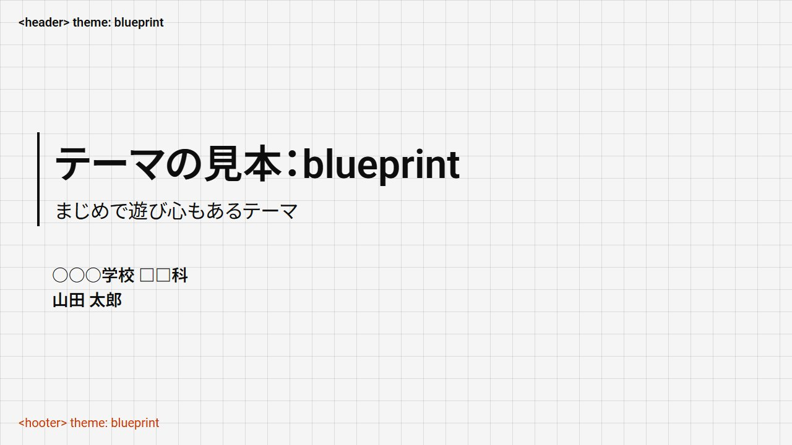

# marp-themes

[Marp](https://marp.app/)というMarkdownでスライド資料を作成できるツールのテーマ集です。

## テーマ

### simple

[PDF](./examples/simple.pdf)

<div style="display: flex; flex-wrap: wrap; gap: 8px" >


</div>

### blueprint

[PDF](./examples/blueprint.pdf)

<div style="display: flex; flex-wrap: wrap; gap: 8px" >



</div>

### pebble

[PDF](./examples/pebble.pdf)

<div style="display: flex; flex-wrap: wrap; gap: 8px" >


</div>

## 使い方

| theme_name | path_to_css                                                                                   |
| ---------- | --------------------------------------------------------------------------------------------- |
| simple     | https://raw.githubusercontent.com/shiguri-01/marp-themes/refs/heads/main/themes/simple.css    |
| blueprint  | https://raw.githubusercontent.com/shiguri-01/marp-themes/refs/heads/main/themes/blueprint.css |
| pebble     | https://raw.githubusercontent.com/shiguri-01/marp-themes/refs/heads/main/themes/pebble.css    |

1. ワークスペースの`.vscode/settings.json`に次の設定を追加します。

```json
{
  "markdown.marp.themes": ["path_to_css"]
}
```

2. Markdownファイルの先頭を次のようにしてください。

```markdown
---
marp: true
theme: theme_name
---
```

## 機能

- タイトルページ
- アクセントカラー
- 中央寄せ
- 段組み
- 矢印

> [!NOTE]
> 見本として`simple`テーマの画像を添付していますが、すべてのテーマで動作します。

### タイトルページ

```markdown
<!--
_class: title
-->
```

タイトルページでは、引用要素を利用して発表者や所属を記載できます。

```markdown
<!--
_class: title
-->

# ここにタイトルが入ります

> 山田 太郎
```


### アクセントカラー

```markdown
<!--
class: blue
-->
```

`red`、`green`、`blue`のいずれかのアクセントカラーを指定できます。

<div style="display: flex; flex-wrap: wrap; gap: 8px" >


</div>

> [!NOTE]
> どの要素にアクセントカラーが適用されるかは、テーマによって異なります。

#### タイトルページと併用する場合

```markdown
<!--
_class: title blue
class: blue
-->
```

### 中央寄せ

> [!WARNING]
> 作成中の機能です。
> スタイルが崩れる場合があります。

#### 上下左右中央

```markdown
<!--
_class: center
-->
```


#### 上下中央

```markdown
<!--
_class: center-y
-->
```


#### 左右中央

```markdown
<!--
_class: center-x
-->
```


### 段組み

```markdown
<div class="columns">
<div>

## 左

</div>
<div>

## 右

</div>
</div>
```


### 矢印

```markdown
<span class="up"></span>
<span class="down"></span>
<span class="right"></span>
<span class="left"></span>

<div class="up"></div>
<div class="down"></div>
<div class="right"></div>
<div class="left"></div>
```


## ライセンス

CC0-1.0
